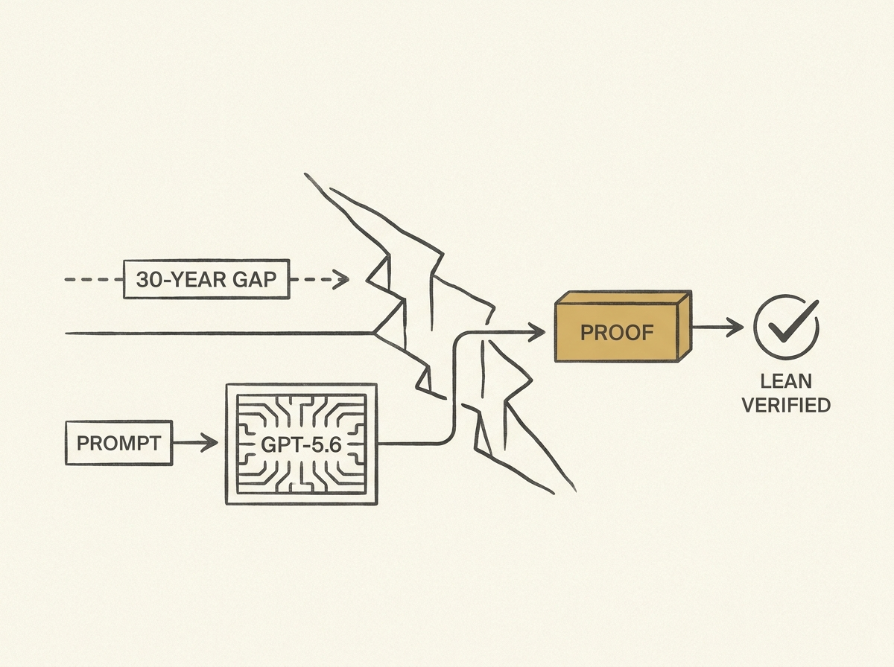

GPT-5.6 recently closed a 30-year gap in convex optimization, not by sheer brute force, but by using a targeted prompt. The resulting proof was independently verified with the Lean theorem prover, adding a layer of rigor. This is a significant leap. 

This is not merely an incremental improvement; it highlights a profound advancement in LLM reasoning capabilities. It moves beyond typical text generation to demonstrate genuine problem-solving in a highly abstract mathematical domain.

Such an achievement suggests that carefully engineered prompts can unlock surprising analytical power, potentially changing how we approach complex computational and mathematical challenges with AI. This is a must-read for anyone building with LLMs.
