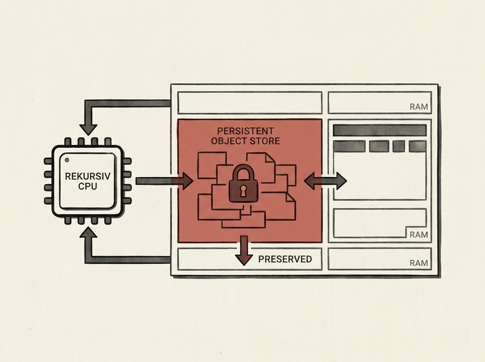

In 1988, a Scottish company called Linn Products shipped the Rekursiv processor, a machine years ahead of its time. It featured hardware-level memory access checking, silicon-based garbage collection, and treated memory and disk as a single persistent object store.

This visionary design, though commercially unsuccessful then, foreshadowed many concepts now appearing in modern systems, like persistent memory and hardware-assisted memory safety. The economic landscape that made it untenable has since reversed.

It is a compelling story of a pioneering system that was right about almost everything, just decades too early.
