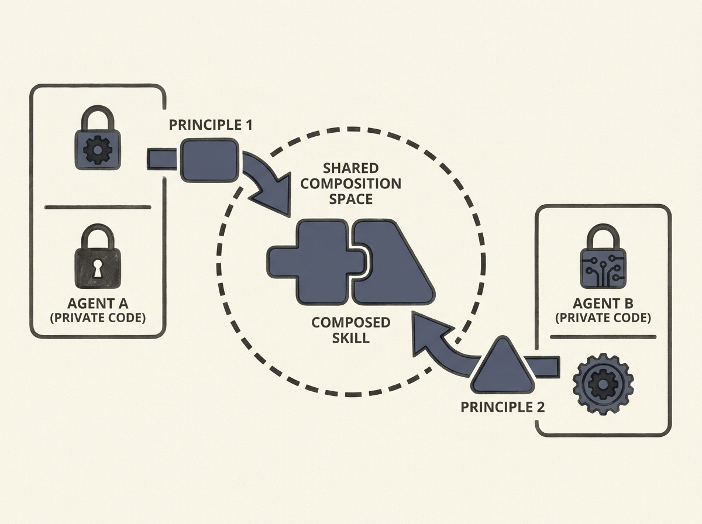

Coordinating multiple AI agents, especially when they need to keep their internal implementations private, is a major hurdle in deploying complex autonomous systems. RELIC introduces an innovative solution that tackles this head-on.

Instead of sharing executable policies or code, agents in RELIC learn and abstract successful behaviors into "portable principles." These principles are then shared and instantiated by other agents within their own interfaces, enabling effective coordination and skill transfer without revealing proprietary implementations. This elegantly separates coordination from the intricacies of implementation.

This framework offers a new paradigm for building multi-agent systems that respect privacy and leverage heterogeneous capabilities. Engineers working on agentic AI will find this approach invaluable for designing robust, scalable, and interoperable multi-agent architectures in real-world scenarios where independent development and data privacy are paramount.
