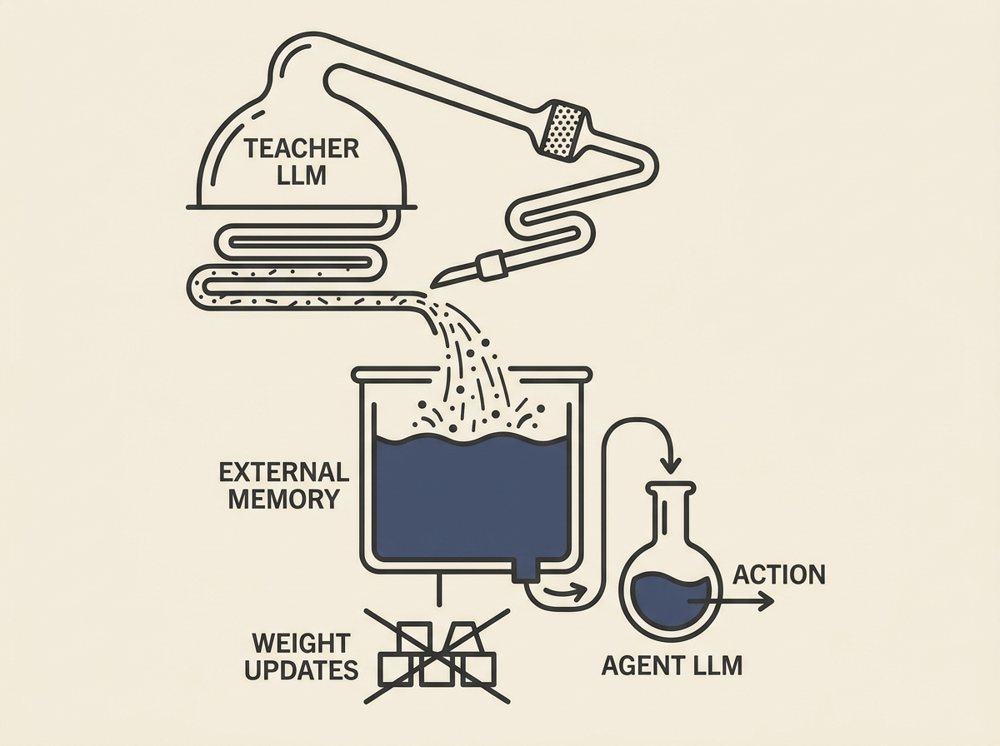

Building capable LLM agents often requires compact models for deployment, even if stronger teachers exist during development. AgentBrew offers a "knowledge brewing" solution to distill a strong teacher's interactive experience into a persistent external memory for weaker student agents. 

This approach bypasses costly weight updates, expert demonstrations, or ground-truth labels. It tackles challenges like sparse feedback and ensuring teacher-authored notes are concretely executable by a substantially weaker student through a "failure-triggered teacher-Ralph Loop" and "student-aware synthesis." 

This innovative paradigm provides a highly practical path to creating deployable, capable LLM agents by making the most of existing, more powerful models without expensive retraining.
