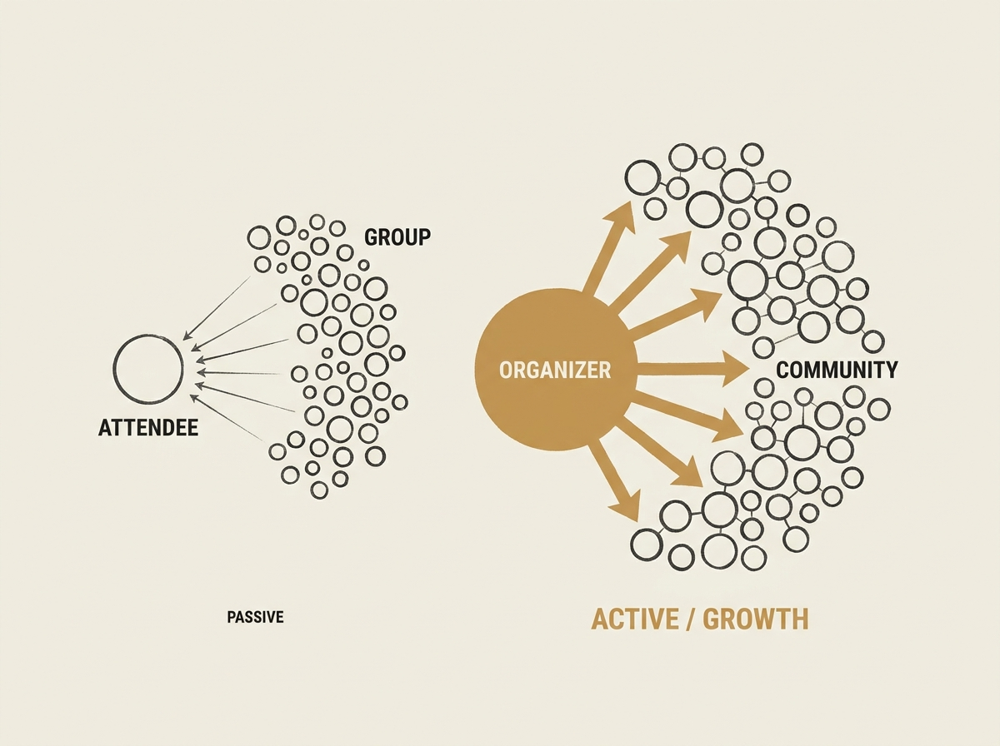

If you want to truly integrate into a new team, community, or professional group, stop just showing up. The fastest way to build influence and make connections is by organizing events yourself.

Many people adopt a consumer attitude toward communities, expecting leaders to magically sprout events. However, most events happen because someone takes the initiative to do the legwork. By stepping up to organize, you immediately differentiate yourself and become indispensable.

This principle applies whether it is an online fanfiction group or a professional engineering community. Those who build, lead.
