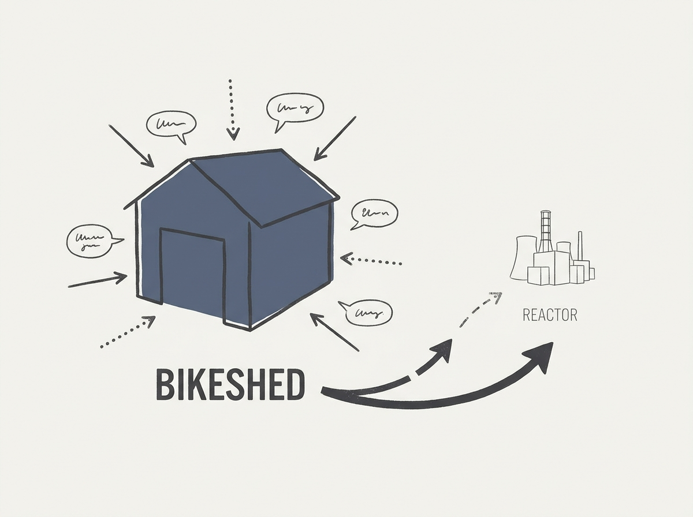

Bikeshedding is a term every engineer knows, but what if it is more than just a time-waster? A recent reflection suggests it is a symptom of deeper organizational dysfunctions that stall progress and drain morale.

The article delves into how seemingly minor disagreements over trivial details can mask a lack of clear vision or shared purpose, leading to endless, unproductive cycles. Recognizing these patterns is the first step towards fostering a more focused and effective engineering culture.

Understanding the root causes of bikeshedding can transform team dynamics and boost real productivity.
