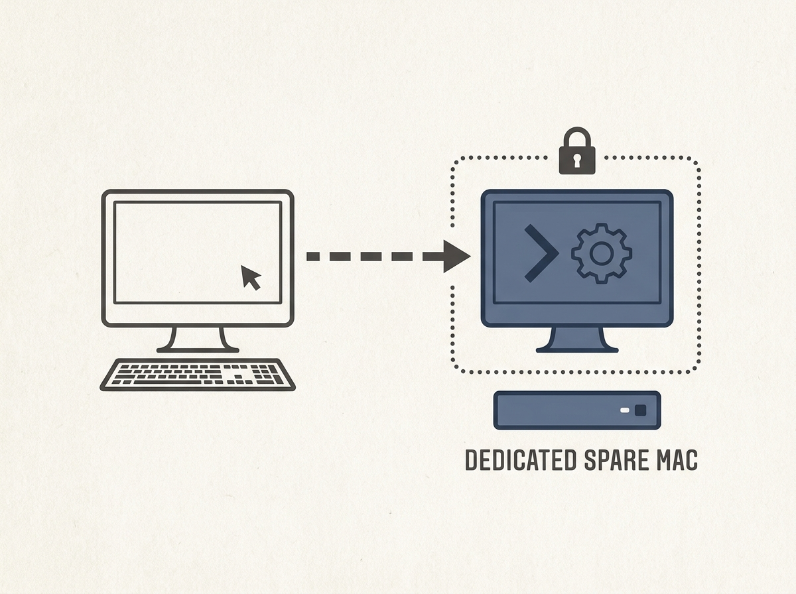

Running AI agents, especially those with computer use enabled like Claude Code, on your primary machine carries inherent risks. A practical guide demonstrates how to set up a dedicated spare Mac for full agent control.

This isolated environment mitigates security concerns by separating potentially risky agent actions from your main workstation. It also offers the added benefit of remote accessibility, allowing you to delegate complex tasks from anywhere via your phone or main computer.

This setup enables safe and efficient experimentation with advanced AI agent capabilities.
