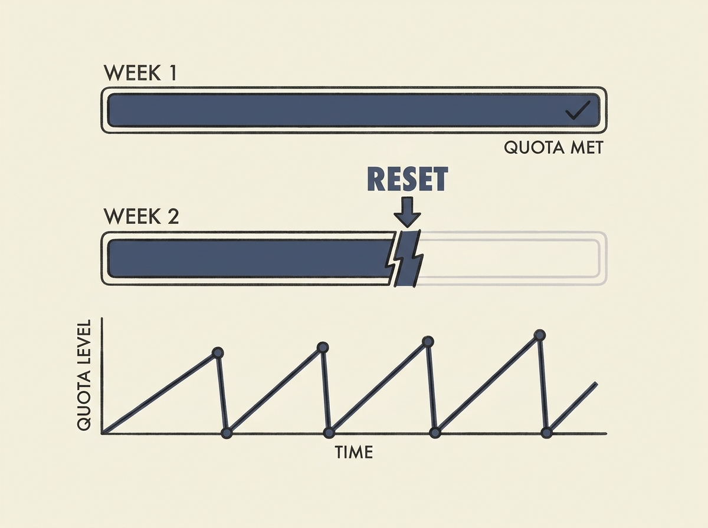

Have you noticed the bizarre increase in quota resets for coding agents like Claude Code and Codex lately? It is happening far more frequently than usual, often unannounced.

These resets are typically used to manage server load or compensate for outages, but the sheer volume recently suggests a deeper operational challenge. Model providers are grappling with how to effectively meter usage and prevent overload, especially with the rising cost of top-tier LLMs.

This gives you a peek behind the curtain at the real-world infrastructure constraints of running advanced AI agent services. It highlights the delicate balance providers must strike between user access and system stability, a crucial aspect of applied AI operations.

Understanding these operational realities is key to building and deploying robust AI systems.
