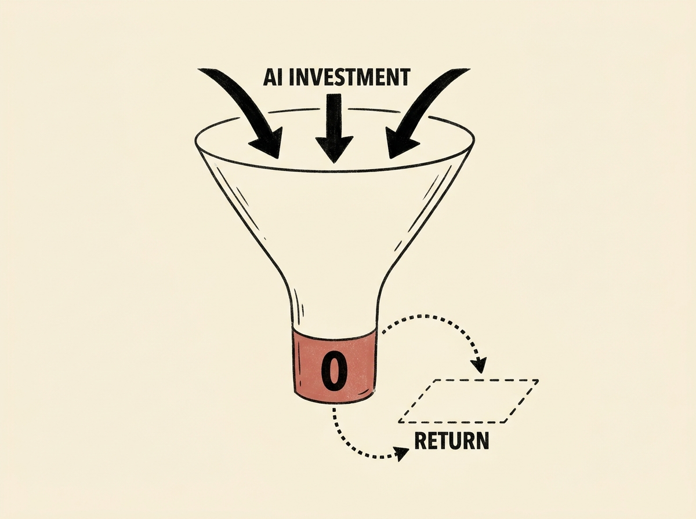

Are you seeing companies making irrational decisions based on AI hype? This post argues that 'AI mania' is actively harming global decision-making, leading to massive investments with little to show for it.

The author, from experience at Fortune 500s and niche services, describes a 'mass psychosis' where organizations are captured by uncritical excitement. Many AI 'solutions' fail because they lack clear plans beyond simply integrating AI.

It is a crucial read for senior engineers navigating this landscape. Understanding these widespread failures can help you champion more realistic, impactful AI strategies, and avoid the pitfalls of technology adoption driven by fear of missing out rather than genuine problem-solving.
