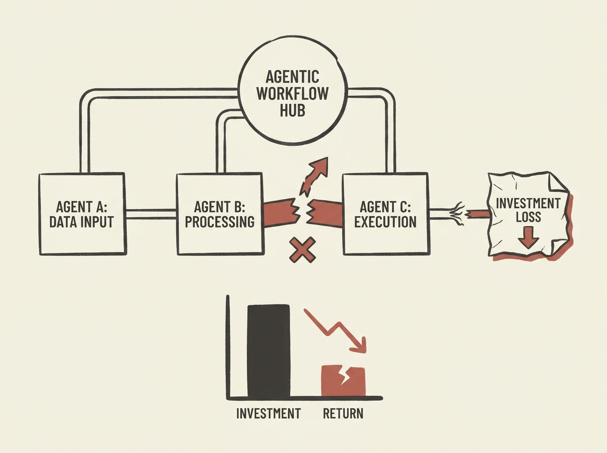

The current enthusiasm for AI is blinding many organizations, leading to significant investment failures, especially when it comes to "agentic workflows." One company found only ten users ever engaged with their agent-focused products.

This piece highlights a crucial problem: simply adopting AI for the sake of it, without understanding its practical limitations, is causing widespread organizational "AI psychosis." Many executives are making decisions based on hype, not tangible results.

For senior engineers, this serves as a vital reality check. It emphasizes the importance of skeptical evaluation and focusing on genuine problem-solving over jumping on every AI trend. Avoid getting caught in the current AI mania.
