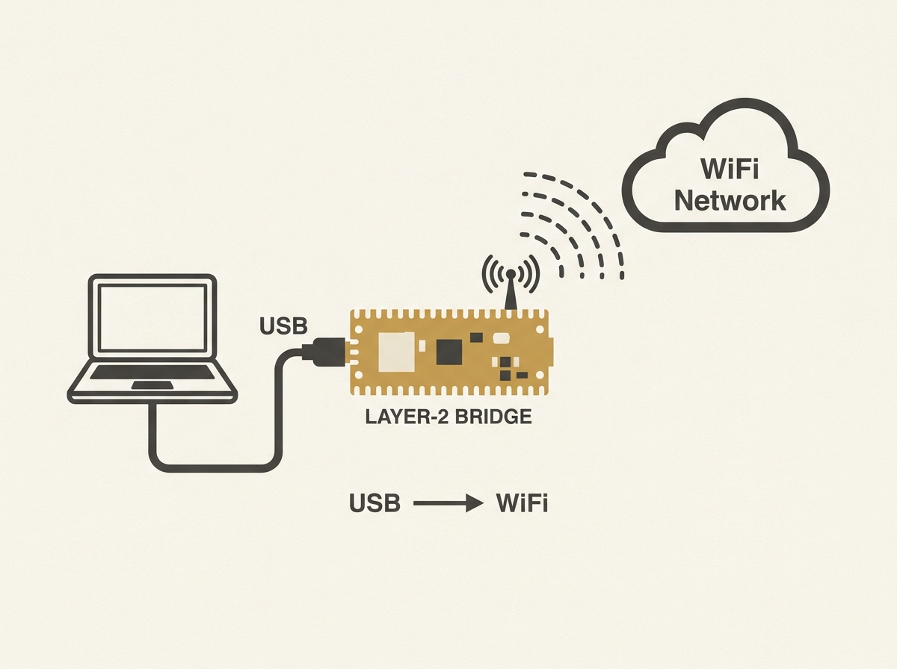

Turning a Raspberry Pi Pico W into a driverless USB WiFi adapter sounds like a hack, but this open-source firmware is a genuinely clever piece of engineering. It implements a transparent Layer-2 bridge between the Pico W's wireless and USB interfaces.

Instead of directly using the WiFi chip as a USB bridge, it exposes an Ethernet connection through USB gadget mode. This allows routing Wi-Fi packets from the network, making it compatible with Windows, Linux, and macOS without needing special drivers.

While throughput is limited by the USB 1.1 interface, it is an excellent example of leveraging embedded hardware and open-source development for practical utility. It teaches concrete lessons in low-level system interfacing and networking principles.
