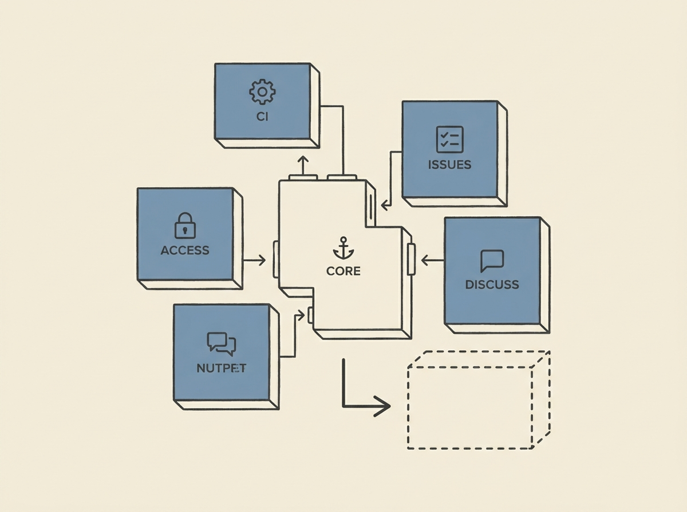

Forget monolithic Git platforms. GitRoot is a small yet powerful Git forge that downloads as a single binary, offering just repository management and access control out of the box.

The real innovation comes from its independent plugin architecture. You can add issues, roadmaps, sprint boards, or even custom merge request flows, all without a heavy web interface if you do not want one.

This approach lets you craft your forge to your project's unique needs, giving you control over workflow without complexity. It is a refreshing take for engineers frustrated by opinionated, all-in-one solutions.
