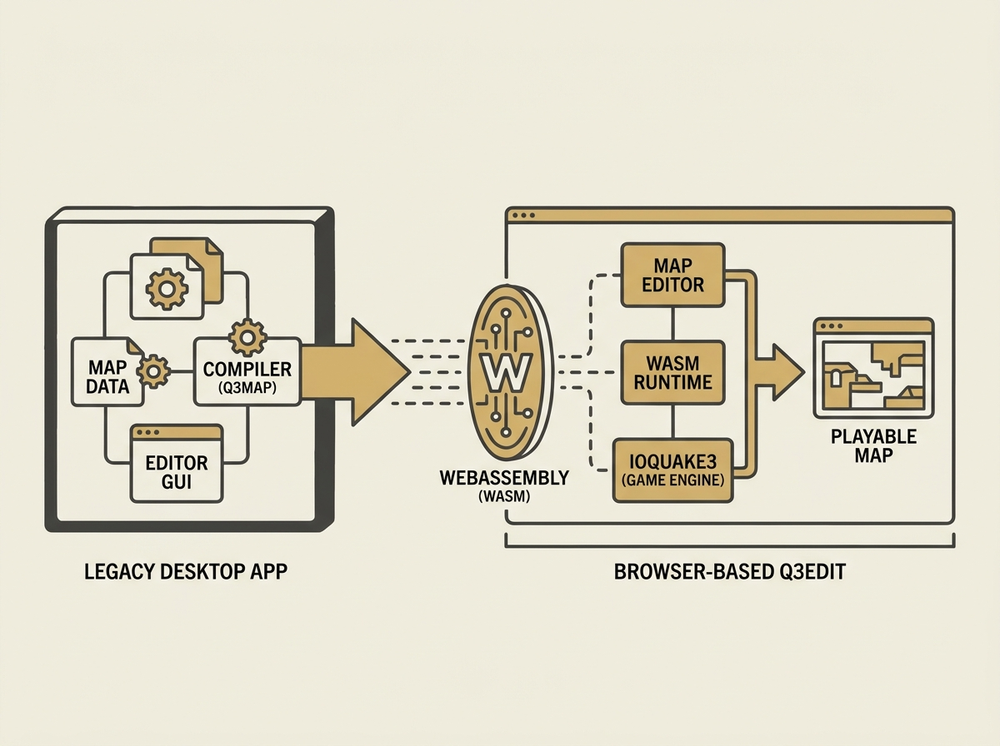

Running complex, legacy desktop applications like Quake 3 map editors directly in the browser is no longer a pipe dream. Q3Edit demonstrates how modern web technologies, specifically WebAssembly, make this a reality.

The project ports id Software's original q3map compiler, a C/C++ powerhouse, to WebAssembly. This allows for full BSP compilation directly in your browser, integrated with a TypeScript + WebGL2 editor. You can literally edit, compile, and play Quake 3 maps without leaving your tab.

This is not just a novelty; it is a profound example of practical system design. It showcases how WebAssembly can handle performance-critical, computationally intensive tasks within the browser, opening doors for rich client-side applications far beyond what was previously thought possible. Think about the implications for AI agent UIs or complex data visualization tools.

This pushes the boundaries of what browser-based engineering can achieve.
