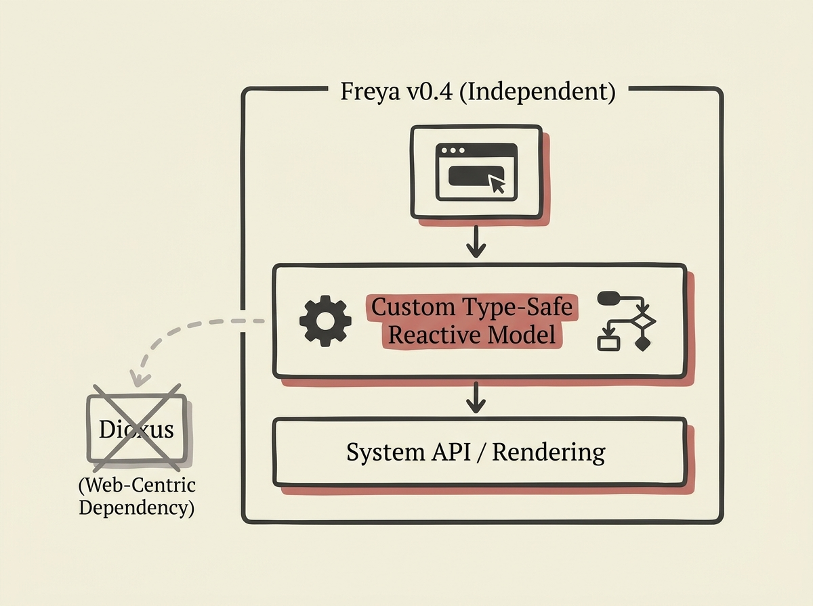

---
authors:
- marc2332
comments: https://news.ycombinator.com/item?id=48960435
date: '2026-07-18'
hn_id: '48960435'
image: 16-hn-48960435-infographic.png
interest_score: 7
section: engineering
source: hn
tags:
- catchup
- custom-component-model
- developer-experience
- dioxus
- freya
- hn
- reactive-system
- rust-gui-library
- type-safety
title: Freya v0.4 rewritten for type safety and independence
url: https://freyaui.dev/posts/0.4
why_read: This announcement explains why the Freya GUI library underwent a significant
  rewrite to develop its own reactive and component model. Readers will understand
  the challenges of external framework dependencies and the benefits of a tailored,
  type-safe internal system for improved developer experience.
---

Rewriting a core library component is never a small feat, but Freya 0.4's shift away from Dioxus to its own reactive and component model is a masterclass in software architecture. The developers built a new system from scratch to achieve better type safety, extensibility, and simplicity.

This move was driven by Dioxus's web-centric design, which imposed limitations on Freya's desired direction. By owning the full stack, Freya can evolve freely, catching typos at compile time and providing more accurate stack traces.

This deep dive into architectural choice and implementation details provides valuable lessons for any engineer building or maintaining complex systems.