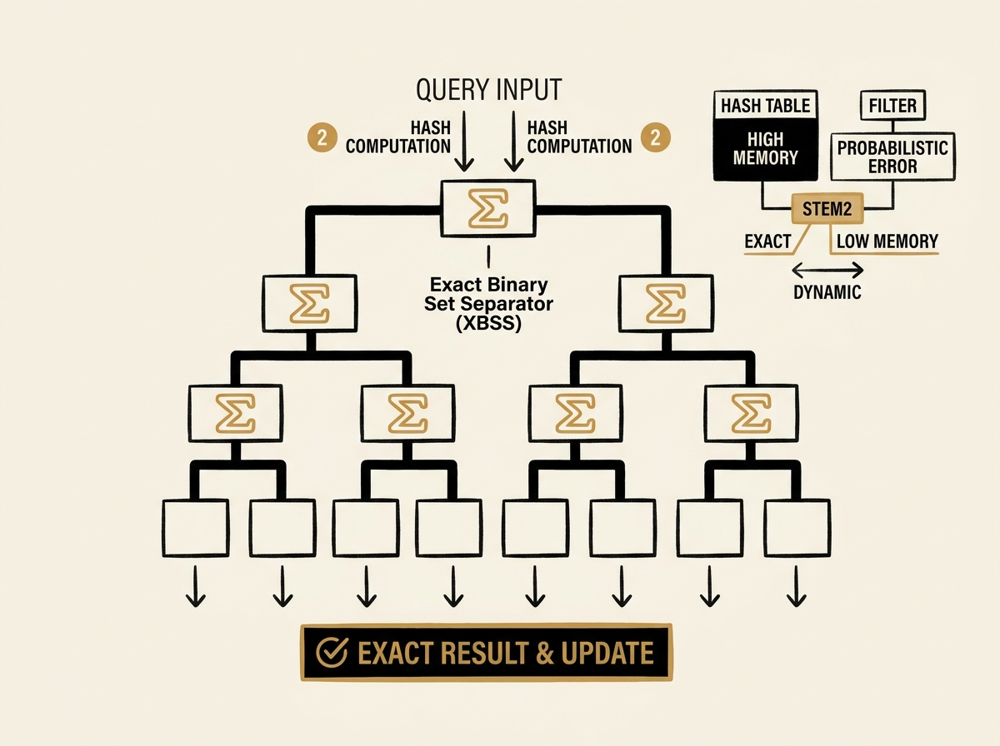

Exact multi-set membership queries are a fundamental problem in databases and networking, but engineers often face a tough trade-off: perfect accuracy with high memory (hash tables) or space efficiency with probabilistic errors (filters). A new data structure, STEM2, offers a breakthrough.

STEM2 achieves 100% query accuracy and supports dynamic updates, all while being remarkably fast and space-efficient. It leverages a balanced binary tree architecture with a novel Exact Binary Set Separator (XBSS) and a minimized hashing scheme that only requires two hash computations per lookup.

The performance numbers are impressive: STEM2 hits over 120 million operations per second (Mops) in lookup throughput, outperforming state-of-the-art solutions like Coloring Embedder by 20% and Ludo hashing by up to 21.6 times. This is a genuinely practical improvement for core database operations.

This new approach means you no longer need to compromise between correctness and performance for critical multi-set queries.