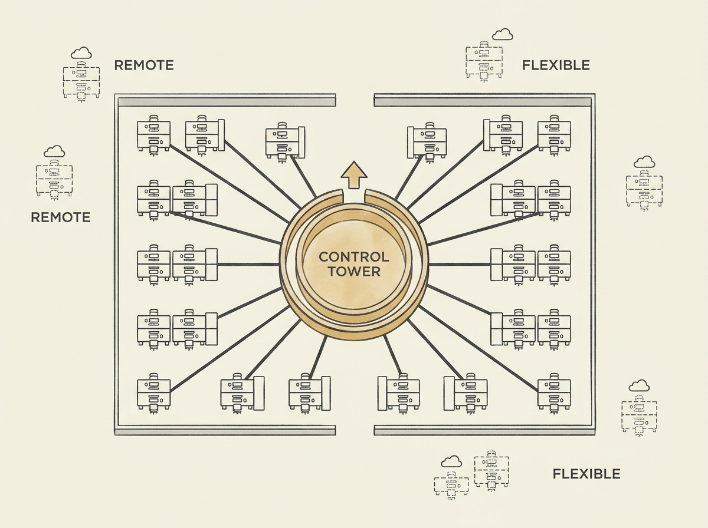

---
authors:
- Sarah Petz
comments: https://news.ycombinator.com/item?id=48958904
date: '2026-07-18'
hn_id: '48958904'
image: 18-hn-48958904-infographic.png
interest_score: 7
section: career
source: hn
tags:
- catchup
- hn
- leadership
- narcissism
- remote-work
- return-to-office
title: Narcissistic leaders are more likely to oppose remote work
url: https://www.cbc.ca/news/business/study-remote-work-narcissism-9.7275176
why_read: This article presents new research suggesting a link between narcissistic
  leadership and opposition to remote work. Readers will learn how leaders' desire
  for power and status can influence return-to-office mandates.
---

Are your leaders pushing for return-to-office? New research from Wharton suggests a surprising correlation: leaders with narcissistic traits are significantly more likely to oppose remote work.

The study found this resistance stems from a desire for power, control, and status. It is less about genuine productivity concerns and more about a leader's need to exert visible authority and receive in-person validation.

This insight can reframe how we understand and navigate workplace policies on remote or hybrid work. It provides a different lens through which to analyze leadership decisions impacting developer productivity and well-being.

Understanding these underlying motivations can empower engineers to advocate more effectively for flexible work arrangements.