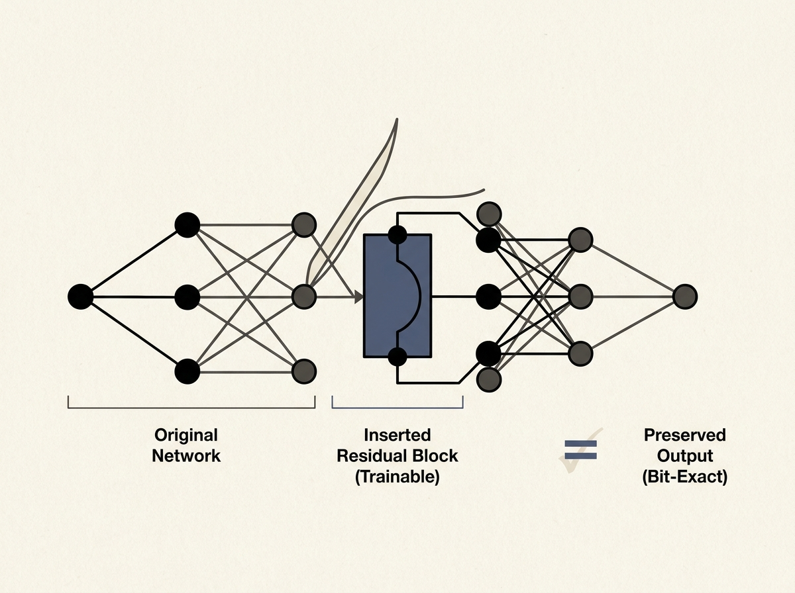

Imagine needing to expand an already trained neural network without destroying its learned function or rebuilding your entire training program. "Exact Network Surgery" is a groundbreaking technique that makes this possible, allowing you to insert residual blocks into a live computational graph *bit-exactly*.

This isn't just theory. The paper proves an identity-morphism theorem ensuring the network function is preserved, and a structural-locality theorem showing that only the directly affected parts of the graph are recomputed. Crucially, the newly inserted parameters become trainable immediately after insertion.

This capability is enormous for iterative model development and continuous deployment in AI systems. It means you can adapt and grow your models in production without costly full retraining cycles, making your AI infrastructure far more agile.

Dynamically evolving neural networks just became a reality.