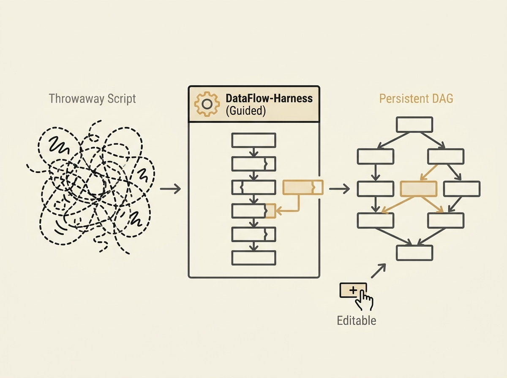

This paper tackles a core pain point with LLM coding agents: they often generate throwaway scripts instead of integrated, editable system artifacts. DataFlow-Harness introduces a new approach.

Instead of free-form code, this platform guides an LLM agent to construct platform-native Directed Acyclic Graphs (DAGs) using typed, incremental mutations. This grounded approach means the agent works within the system's constraints, resulting in persistent, editable workflows.

The results are compelling. It achieves a 93.3% pass rate on a data-engineering benchmark while reducing monetary cost by 72.5% and generation latency by 49.9% compared to vanilla Claude. This highlights the power of structured guidance and live platform context for agentic AI.

The key insight is that tightly coupling the agent with the underlying platform's operator registry and state enables more reliable, efficient, and maintainable AI-driven automation. This is a significant step towards practical, production-ready AI agents.