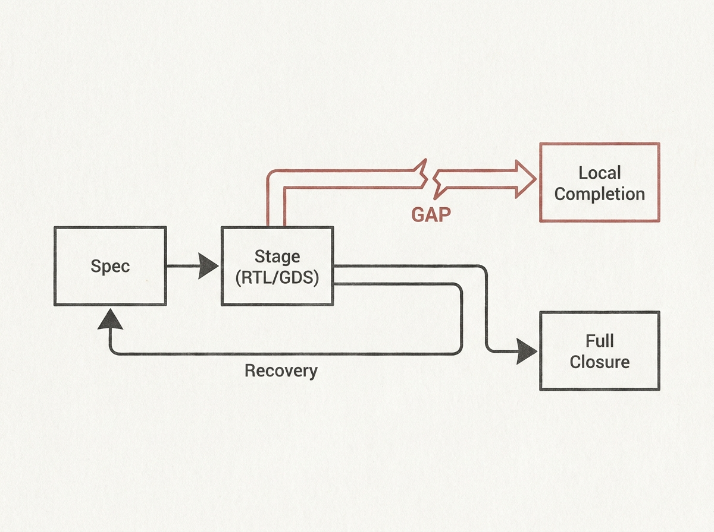

Building AI agents that can tackle real-world, multi-stage engineering tasks is hard, especially when tool feedback is delayed or inconsistent. Most benchmarks fall short, measuring only isolated parts of the process.

CLOSER-Bench steps in with a novel evaluation protocol specifically for budgeted cross-stage design closure in hardware engineering. It tracks everything from spec-to-RTL to GDS, recording every simulator and synthesis invocation. This gives a holistic view of agent performance.

A key takeaway from their pilot study is the significant "completion-closure gap." An agent might "complete" a local task, but fail when faced with the full design "closure" process that requires cross-stage recovery. This highlights the need to treat agent workflows as budgeted sequential decision problems, not just isolated code generation.

This benchmark provides crucial insights for anyone working on agentic systems, emphasizing the importance of evaluating agents not just on isolated success metrics, but on their ability to navigate and recover through complex, real-world engineering pipelines.