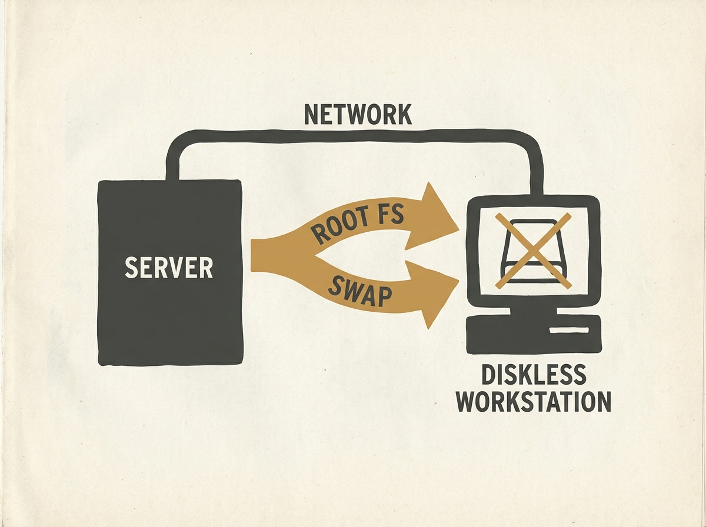

---
authors:
- Chris Siebenmann
comments: https://news.ycombinator.com/item?id=48959332
date: '2026-07-18'
hn_id: '48959332'
image: 21-hn-48959332-infographic.png
interest_score: 7
section: systems
source: hn
tags:
- catchup
- hn
- http-headers
- llm-data-collection
- user-agent
- web-crawlers
- website-blocking
title: Proper HTTP User-Agent identification prevents website blocking by generic
  crawlers
url: https://utcc.utoronto.ca/~cks/space/blog/solaris/SunOSDisklessWithoutNFS
why_read: Read this to understand why websites block generic HTTP User-Agents and
  how to properly identify your client or bot to avoid being blocked.
---

Before NFS became the standard for network file systems, SunOS faced the challenge of diskless workstations. The solution involved deep kernel modifications to enable machines to boot and function entirely over the network, a monumental task for its time.

This was not a simple network boot. The system had to serve the entire root file system, handle paging, and manage temporary storage without any local disk. It provided a robust, if complex, method for centralized management and deployment of workstations.

Understanding these early approaches offers a fascinating glimpse into the evolution of distributed systems. It highlights how engineers tackled fundamental resource sharing and boot problems that underpin much of our modern networked infrastructure, reminding us that many 'new' problems have deep historical roots.

A great historical dive into core system challenges.