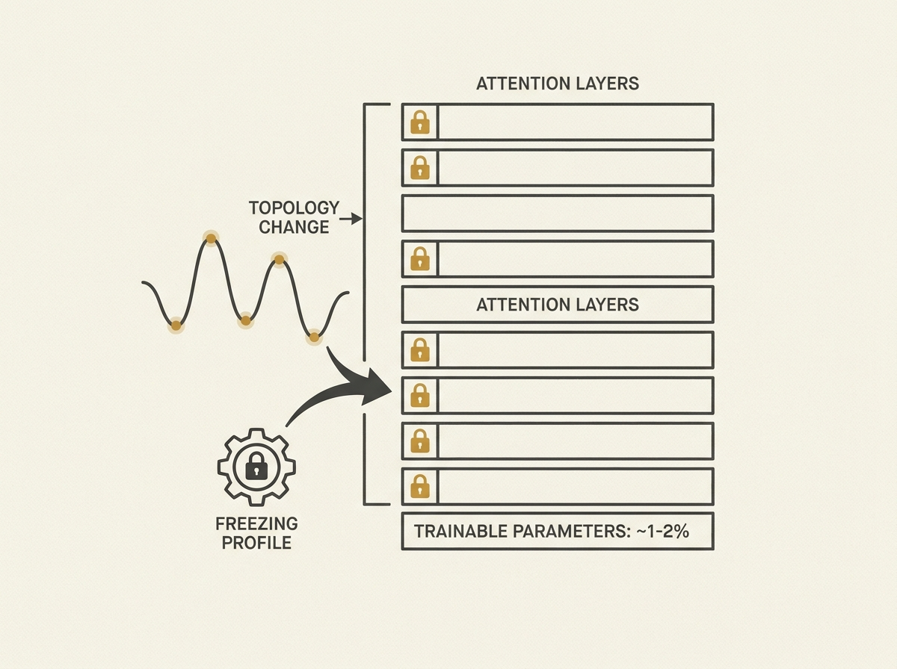

Fine-tuning large language models can be incredibly resource-intensive, even with techniques like LoRA. TopoTuner introduces a fundamentally different approach to parameter-efficient fine-tuning.

This method uses topological data analysis to identify which attention projection matrices are critical for a given task, selectively freezing others. By measuring how the topology of these matrices changes during adaptation, TopoTuner learns a "freezing profile."

The results are impressive: TopoTuner trains only 1-2% of model parameters, achieving performance comparable to full fine-tuning and often outperforming LoRA. This translates to significant reductions in training time and cost. The concept of reusable freezing profiles is a game-changer for efficiently adapting LLMs across tasks.

This paper provides a fresh perspective on optimizing LLM adaptation, showing how a deeper understanding of model architecture can lead to substantial gains in efficiency and broader applicability for applied AI.