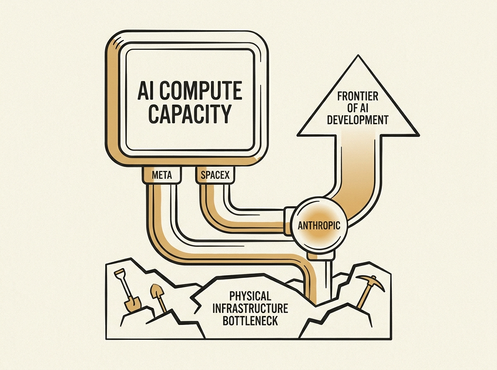

---
authors:
- gslin
comments: https://news.ycombinator.com/item?id=48954209
date: '2026-07-18'
hn_id: '48954209'
image: 22-hn-48954209-infographic.png
interest_score: 7
section: ai
source: hn
tags:
- ai-chips
- anthropic
- artificial-intelligence
- catchup
- compute-power
- corporate-partnerships
- hn
- meta
- spacex
title: Anthropic secures AI compute power through deals with Meta and SpaceX
url: https://www.cnbc.com/2026/07/17/anthropic-meta-ai-compute.html
why_read: Understand how Anthropic is securing critical AI compute power through deals
  with companies like Meta and SpaceX. This reveals the strategic challenges and solutions
  for leading AI labs in the competitive AI chip landscape.
---

The scramble for AI compute power just took another interesting turn: Anthropic, a leading AI lab, is reportedly in early talks to lease significant computing capacity from Meta. This move underscores a fundamental challenge facing the entire AI industry.

Access to vast arrays of specialized AI chips, primarily from Nvidia, remains the single biggest bottleneck for developing and scaling advanced LLMs. Even well-funded players like Anthropic must forge strategic partnerships to secure the necessary hardware.

This situation reveals the true 'picks and shovels' economy underlying the AI boom. While models rapidly advance, the physical infrastructure to train and run them is a finite, highly contested resource. Understanding these compute constraints is crucial for anyone building in the AI space.

Compute capacity defines the frontier of AI development.