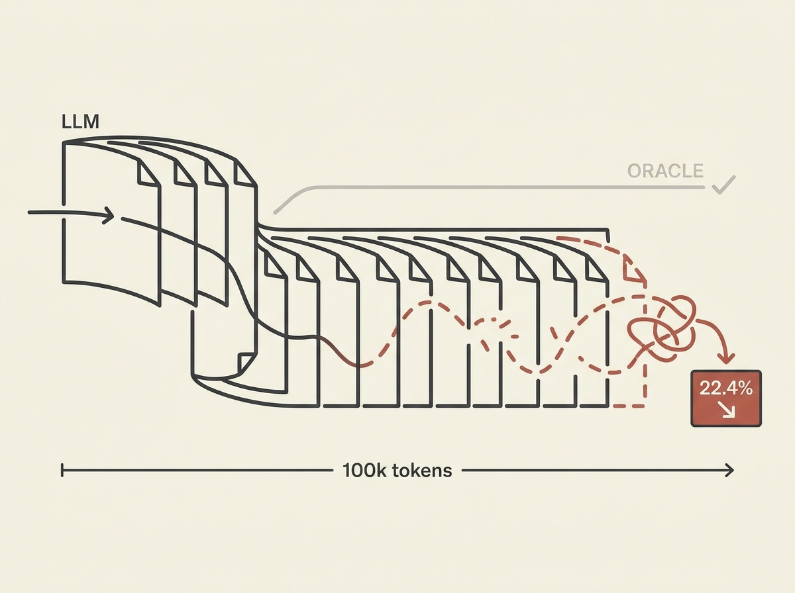

LLM agents are powerful, but how well do they *really* remember and reason over long, complex interactions? A new benchmark, RECON, exposes severe limitations that every agent builder needs to understand.

RECON tests compositional reasoning over case files up to 100,000 tokens, challenging agents with tasks like multi-hop evidence chains, propagating cascading invalidations, and resolving source conflicts. The results are sobering: even the best non-Oracle systems achieve only 22.4 percent accuracy. This highlights that simply increasing context window size does not guarantee robust reasoning.

This benchmark is a crucial tool for engineers. It pinpoints exactly where current agent architectures fail, providing a roadmap for developing more reliable and intelligent autonomous systems. It is not just about retrieving facts; it is about reasoning over their implications.