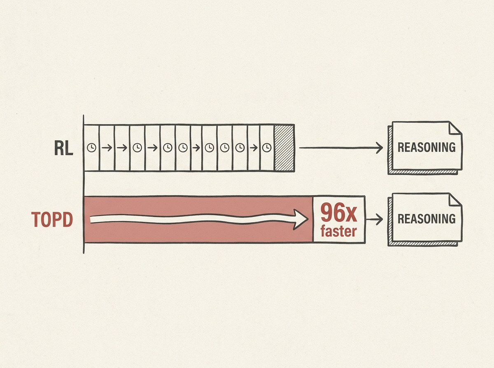

Training reasoning-capable diffusion language models (dLLMs) has been a challenge, often requiring complex reinforcement learning setups. This new approach, Trace-Based On-Policy Distillation (TOPD), offers a fascinating alternative.

Instead of sparse rewards or value modeling, TOPD uses a teacher model to supervise a dLLM on its own denoising trajectory. By focusing on trace-aligned token decisions, it provides dense supervision without the overhead of reward estimation.

The results are impressive: TOPD enables models to match RL-trained counterparts on mathematical reasoning benchmarks with a 96x estimated model-compute speedup. This is a game-changer for efficiently instilling reasoning capabilities into dLLMs, making them much more practical for real-world applications.