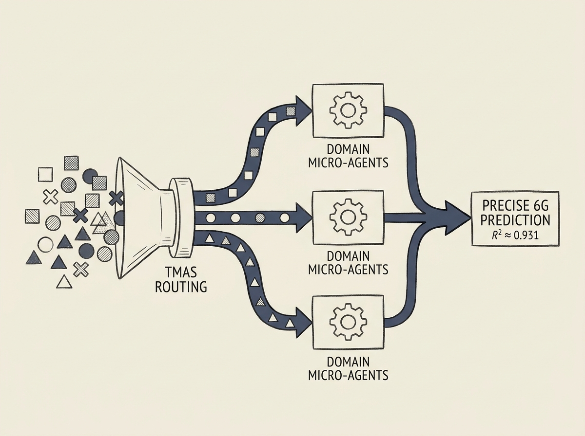

Predicting 5G throughput reliably across diverse operators, mobility modes, and traffic types is crucial for next-generation resource orchestration. Monolithic machine learning models often fall short, but a new Tiered Multi-Agent System (TMAS) offers a compelling solution.

TMAS dynamically routes edge telemetry to context-aware Domain Micro-Agents, enabling it to generalize effectively across heterogeneous urban environments. This agentic approach tackles the "stochasticity gap" between signal conditions and achievable throughput.

The performance is remarkable: TMAS achieved an R2 of up to 0.931 and a Mean Absolute Error as low as 0.53 Mbps on a real-world dataset. Crucially, its operational efficiency is high, with inference latencies and agentic routing overhead well within the response times required by 6G networks. This is a powerful demonstration of multi-agent systems in action.