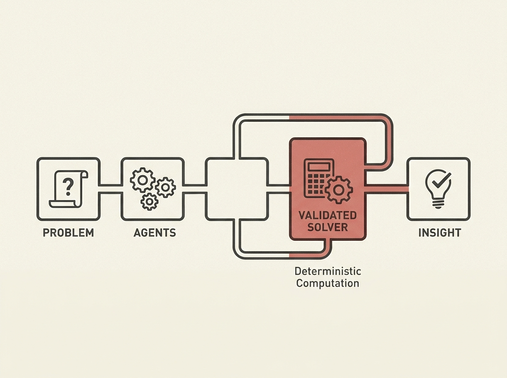

This paper introduces a multi-agent LLM framework that automates structural reliability analysis, transforming natural language problem statements into actionable insights. It addresses a core challenge: how to reliably use LLMs for tasks requiring precise computation.

The framework employs specialized agents for distinct steps: problem formulation, method planning, code generation, execution, and result interpretation. Crucially, while LLMs handle the orchestration, validated deterministic solvers perform the actual reliability calculations, ensuring computational trustworthiness and reducing hallucination risks.

This design choice is key for building robust applied AI systems. It demonstrates a powerful pattern for senior engineers: leverage multi-agent LLMs for complex workflow automation while delegating critical, verifiable computations to traditional, reliable components. This approach significantly lowers the expertise barrier for specialized fields.