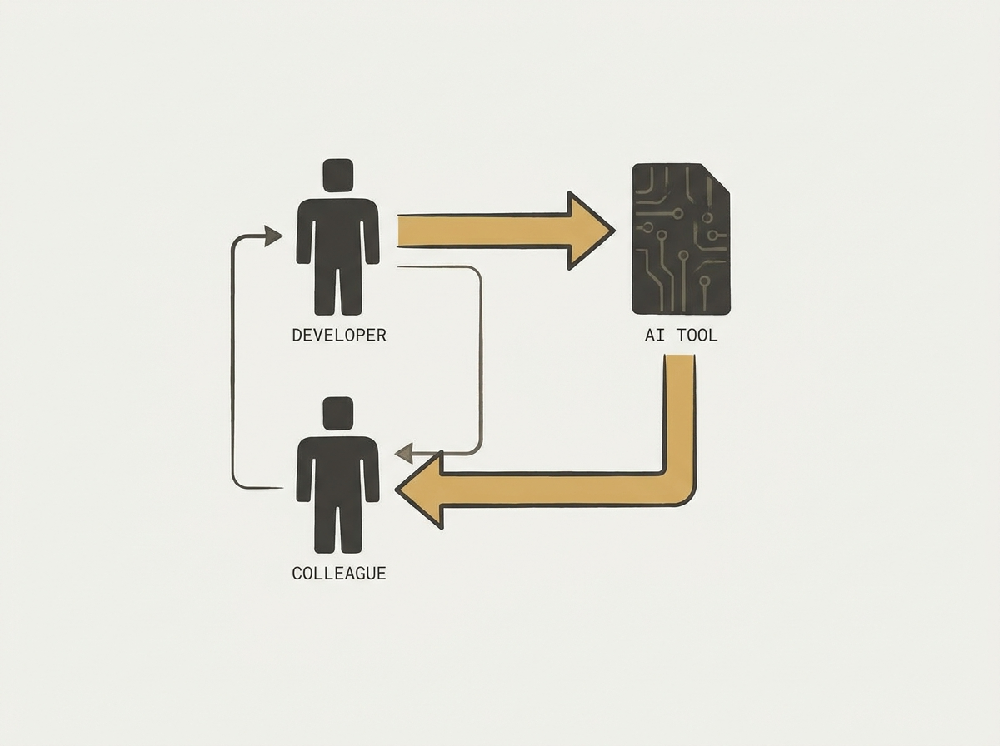

Generative AI tools are reshaping software engineering, but not always in obvious ways. A new study reveals that while GenAI can broaden developers' creative repertoires, it also risks narrowing independent ideation.

Critically, developers are increasingly consulting AI instead of colleagues, which can weaken peer learning and mentorship. This highlights a subtle but significant shift in team dynamics.

However, the research also identified emerging 'triadic collaboration' patterns where developers, colleagues, and AI reason together. Understanding these changes is crucial for fostering effective teams in an AI-augmented world.