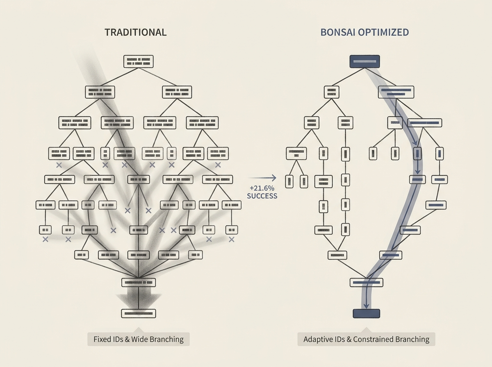

Decoding tries are critical for constrained beam search in LLM-based generative recommendation, but their structural design is often overlooked. New research shows that optimizing these tries can yield significant performance gains.

The BONSAI framework achieves up to a 21.6% relative improvement by co-designing textual term IDs and their underlying decoding trie. Key insights include ensuring adaptive, variable ID lengths and constrained branching factors, especially at shallow levels, to drastically improve search success.

This is not about bigger models, but smarter infrastructure. Engineers working on applied AI and LLM inference can leverage these principles to make their generative systems more efficient and effective.