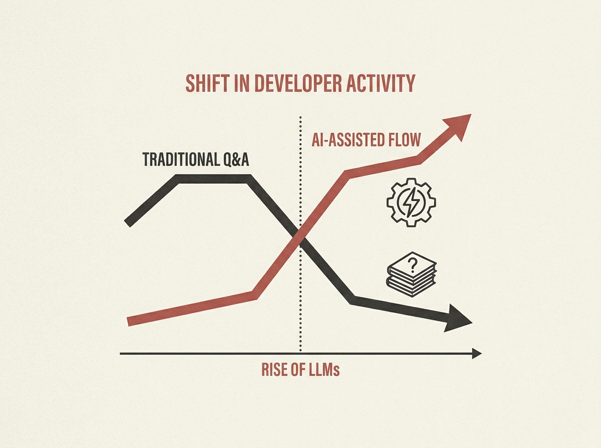

---
authors:
- secretslol
comments: https://news.ycombinator.com/item?id=48956949
date: '2026-07-18'
hn_id: '48956949'
image: 41-hn-48956949-infographic.png
interest_score: 7
section: engineering
source: hn
tags:
- artificial-intelligence
- catchup
- data-visualization
- hn
- stackoverflow
title: Visualizing AI's Impact on Stack Overflow
url: https://data.stackexchange.com/stackoverflow/query/1953768#graph
why_read: This graph-based analysis offers insights into the specific effects of AI
  on the Stack Overflow platform. Readers will understand how AI's emergence has influenced
  a major developer resource.
---

AI is changing how developers work, and Stack Overflow data shows it clearly. New graphs reveal a significant shift in user activity and content generation patterns, coinciding with the rise of LLMs. This is more than anecdotal; it is a measurable change.

The data provides a fascinating look into how engineers are interacting with traditional knowledge bases versus new AI tools. Understanding these shifts is crucial for anyone thinking about developer productivity and the future of engineering practices.

See the numbers for yourself and reflect on what this means for your team's workflow.