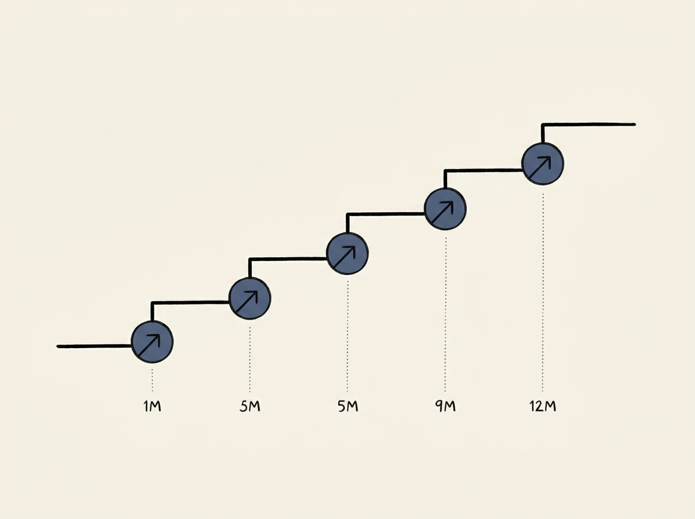

---
authors:
- denysvitali
comments: https://news.ycombinator.com/item?id=48963465
date: '2026-07-18'
hn_id: '48963465'
image: 42-hn-48963465-infographic.png
interest_score: 7
section: ai
source: hn
tags:
- announcements
- catchup
- chatgpt-work
- codex
- hn
- thsottiaux
- usage-limits
title: How usage limits reset for Codex and ChatGPT Work
url: https://codex-resets.com/
why_read: This text provides a historical log of usage limit resets for Codex and
  ChatGPT Work, explaining how these are announced and triggered by user milestones.
---

Curious how large-scale AI services handle capacity and usage? This tracker for OpenAI's Codex and ChatGPT Work usage limit resets offers a fascinating glimpse into real-world LLM infrastructure management.

It aggregates official announcements, often linked to user growth milestones like 9 million active users, and even mentions challenges in keeping the infrastructure up. This shows the operational realities behind massive AI scaling, beyond just model performance.

Understanding these public signals helps in anticipating challenges and strategies for building and scaling your own applied AI systems. It is a subtle but important detail for engineers working on LLM infrastructure.