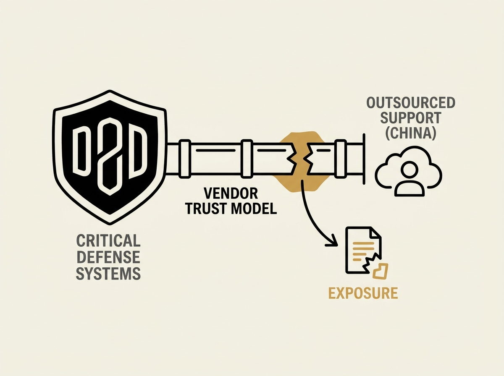

---
authors:
- Renee Dudley
- Jessica Lussenhop
comments: https://news.ycombinator.com/item?id=48963539
date: '2026-07-18'
hn_id: '48963539'
image: 44-hn-48963539-infographic.png
interest_score: 7
section: systems
source: hn
tags:
- catchup
- china
- cybersecurity
- department-of-defense
- digital-escorting
- hacking
- hn
- investigative-journalism
- microsoft
title: Microsoft's 'Digital Escorts' Left DOD Vulnerable to Chinese Hackers
url: https://www.propublica.org/podcast/microsoft-digital-escorts-china-defense-department
why_read: Readers should engage with this text to understand how a major tech company's
  practices created a national security risk. It details an investigative journalism
  process that uncovered a surprising vulnerability and influenced government policy.
---

Microsoft's practice of using "digital escorts" in China for Department of Defense tech support created a staggering supply chain vulnerability, leaving critical U.S. defense systems exposed to Chinese hackers. This was not a hypothetical risk; it was an active exposure due to an outsourced operational model.

The investigation uncovered that Microsoft engineers in China, providing support for sensitive DoD systems, had privileged access that could be exploited. This scenario illustrates how deeply embedded vendor choices can compromise the integrity of even the most secure environments, moving beyond typical cybersecurity measures to a fundamental trust issue.

This serves as a crucial case study for senior engineers and system architects. It underscores the profound importance of end-to-end supply chain vetting and understanding the geopolitical implications of critical vendor relationships. A system is only as secure as its weakest link, and often, that link is not code, but the human and organizational design.

Rethink your vendor trust models for critical infrastructure.