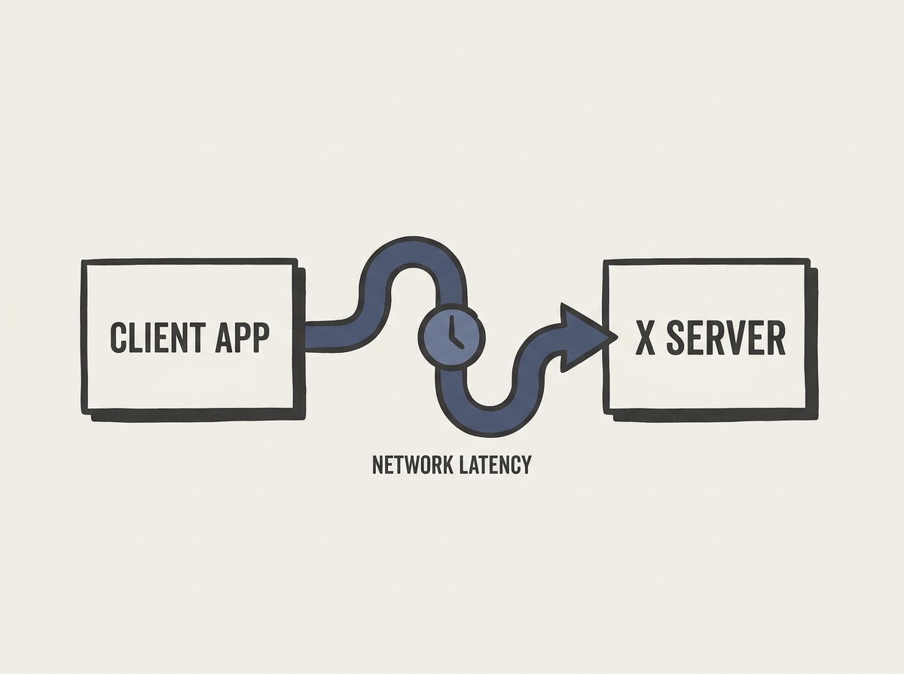

---
authors:
- signa11
comments: https://news.ycombinator.com/item?id=48953733
date: '2026-07-18'
hn_id: '48953733'
image: 46-hn-48953733-infographic.png
interest_score: 7
section: systems
source: hn
tags:
- catchup
- hn
- window-system
- x-window-system
title: Why X is Not Our Ideal Window System
url: https://people.freedesktop.org/~ajax/WhyX.pdf?__goaway_challenge=meta-refresh&__goaway_id=c287e9be33122e4fedfedef2cc9493bb&__goaway_referer=https%3A%2F%2Fold.reddit.com%2Fr%2Flinux%2Fcomments%2F1uz02cz%2Fwhy_x_is_not_our_ideal_window_system_1990%2F
why_read: This article explains the reasons why the X Window System is considered
  suboptimal. Readers will gain an understanding of its limitations and why an alternative
  might be preferable.
---

The X Window System, despite its longevity, is fundamentally constrained by its network transparency design principle. This early architectural choice meant every operation could potentially traverse a network, leading to inherent latency, increased complexity, and persistent security challenges, even during local usage.

This design decision often forces a lowest-common-denominator approach, making it difficult to optimize for modern graphics hardware or to integrate efficiently with contemporary compositing window managers. The client-server model, while groundbreaking for its era, established a heavyweight protocol that struggles to meet today's demands for high-performance graphical interfaces and fluid mobile environments.

Understanding these deep-rooted architectural constraints from X's inception reveals precisely why it struggles to adapt to evolving computing paradigms. This historical perspective offers critical lessons in the enduring trade-offs involved when designing foundational system components, providing valuable context for appreciating the design decisions in successor systems like Wayland or various mobile OS graphical stacks.

Every architectural abstraction carries its own distinct set of hidden costs.