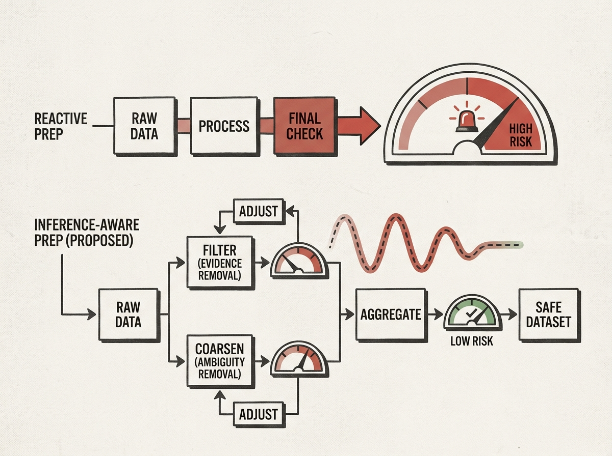

Working with sensitive data for AI/ML or analysis? Most privacy efforts kick in *after* data is prepared, leading to last-minute fixes. This paper flips that by proposing *inference-aware privacy guidance* throughout the data preparation process.

It introduces a framework that models how each step of data curation (dropping attributes, coarsening values) alters the evidence available to an adversary. This means you get real-time feedback on privacy risks, enabling proactive adjustments rather than reactive ones.

The key insight is separating operators that remove evidence from those that remove ambiguity, explaining why privacy effects can be non-monotone. This is a game-changer for building truly safe and useful datasets.

Stop guessing at privacy; start guiding it.