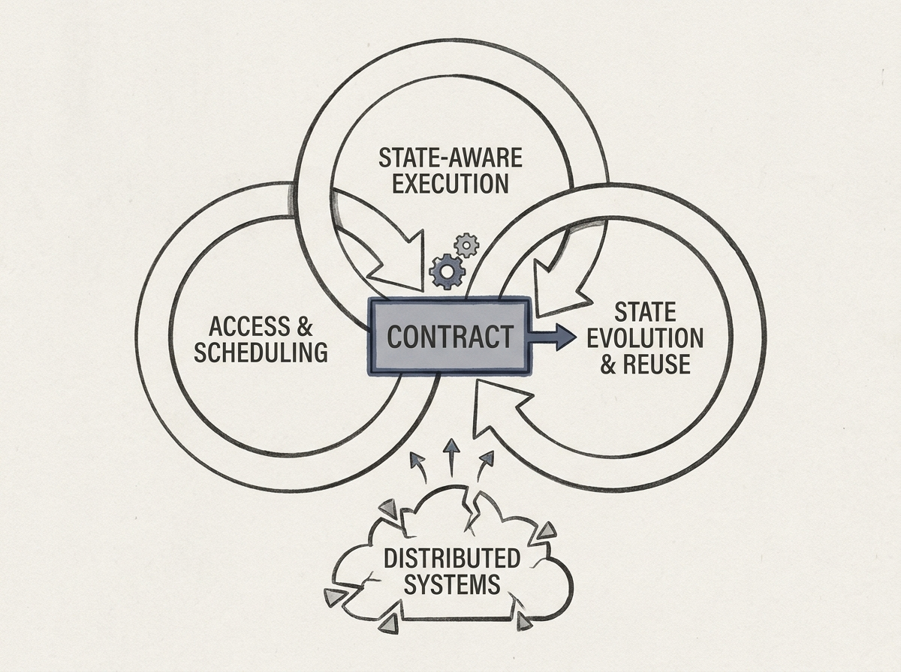

Managing shared state in distributed systems is notoriously complex. This paper argues that it should be viewed not just as a storage problem, but as a *runtime control problem* that impacts performance and failure behavior across streaming, serving, and AI systems.

The authors synthesize vast literature, breaking state management into three interconnected dimensions: access and scheduling, state-aware execution, and state evolution and reuse. This unified view helps uncover recurring anti-patterns often missed when these aspects are considered in isolation.

You will find a "contract-oriented blueprint" and "disturbance-aware evaluation agenda" which can inform how you design more resilient and performant distributed systems. This shifts the focus from fragmented solutions to a holistic control perspective.

Rethink how you approach state in your next distributed system design.