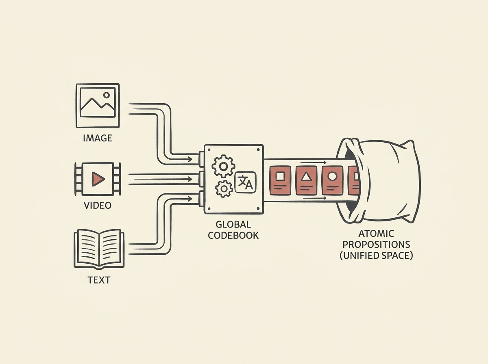

The challenge with multimodal AI has always been disparate data formats: how do you get images, video, and text to "speak the same language" for robust reasoning? This paper proposes a powerful solution: representing all multimodal data as a "bag of atomic propositions."

Imagine a global semantic codebook that unifies every observation - whether from an image, video, or text - into a shared vocabulary of simple, interpretable statements about entities, actions, and relations. This creates one interpretable space, spanning fine-grained facts to high-level concepts.

This framework brings significant advantages: enhanced interpretability with stronger reasoning capabilities, seamless cross-modal understanding and retrieval, and true compositionality. For engineers building complex multimodal systems, especially in areas like autonomous driving, this could be a game-changer for data curation and structured retrieval.

Unifying modalities into a common language unlocks deeper AI intelligence.