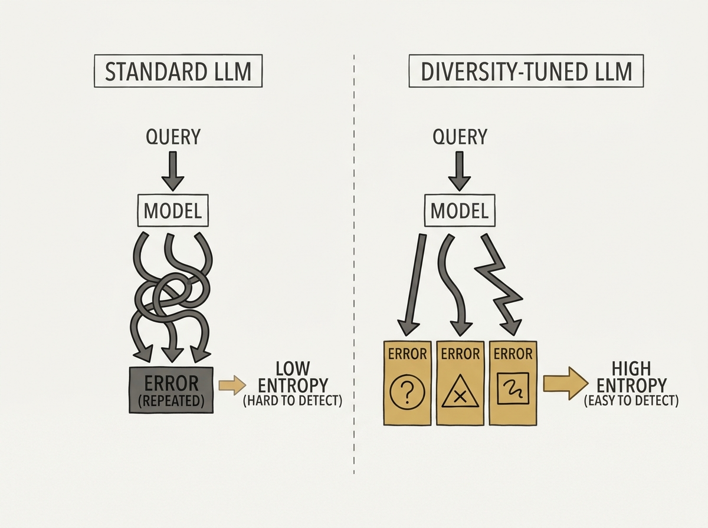

Hallucinations remain a major hurdle for deploying LLMs reliably in production. Most detection methods are applied *after* generation, but what if the model itself could be trained to make its hallucinations more obvious?

This paper proposes "diversity-oriented fine-tuning." The core insight is that many undetected hallucinations occur because the LLM consistently produces the same incorrect answer, leading to low semantic entropy that mimics correct answers. By encouraging more varied (yet still incorrect) generations during fine-tuning, the model's uncertainty signals become clearer for hallucinated outputs.

They achieve this using both Supervised Fine-Tuning (SFT) and Direct Preference Optimization (DPO) strategies. This novel approach significantly improves the effectiveness of semantic-entropy-based hallucination detection, demonstrating a proactive way to build more reliable LLM applications.

This is a practical and impactful contribution, moving beyond mere detection to actually shaping model behavior for improved safety and trustworthiness in applied AI.