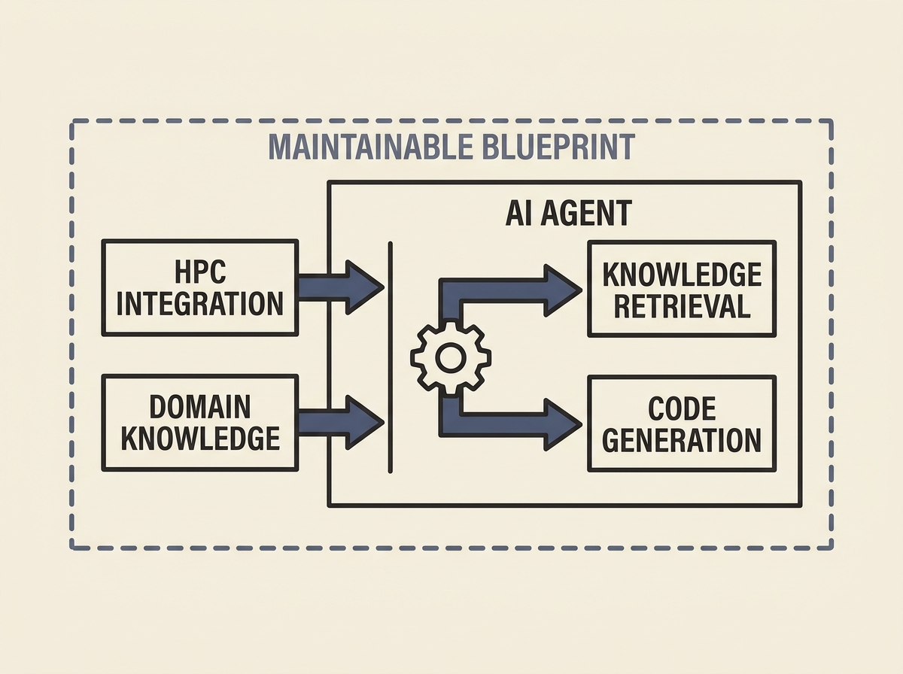

Deploying AI agents in real-world scientific data analysis offers unique challenges, like integrating with high-performance computing and navigating domain-specific knowledge. A new system shows how to build agents for scientists facing data overload. 

This agentic AI assists with knowledge retrieval and source code generation, demonstrating a practical application of LLM agents. The design science approach, involving expert interviews and user studies, provides a blueprint for tailoring AI solutions to highly specialized environments. 

Learning from these challenges can help engineers design more effective and maintainable AI support systems in complex domains.