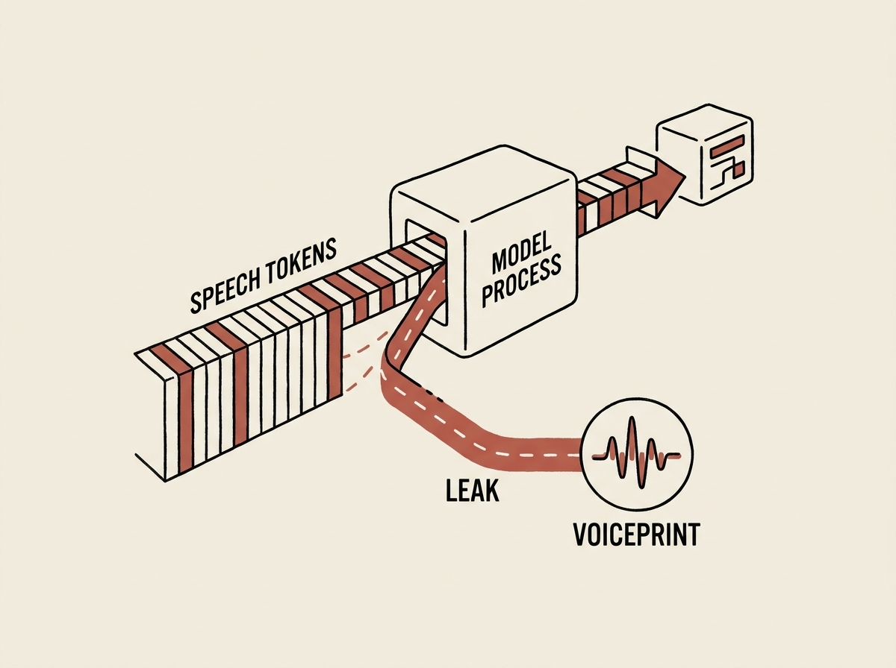

Your speech-enabled LLM might be leaking more than just text. New research reveals a concerning vulnerability: speaker voiceprints can be recovered directly from speech tokens, even from just three seconds of audio.

This is not a theoretical threat. A new method called SpInv, using an "Audio BERT" model, achieved over 0.70 cosine similarity in recovering speaker embeddings from models like Moshi and Kimi-Audio. This implies that the internal speech representations retain significant speaker identity, posing a privacy risk for deployed systems.

For engineers building applied AI solutions with speech, this means rethinking how intermediate speech tokens are handled. Protecting user privacy in LLM infrastructure goes beyond just text data; it extends deeply into the very fabric of speech representation.