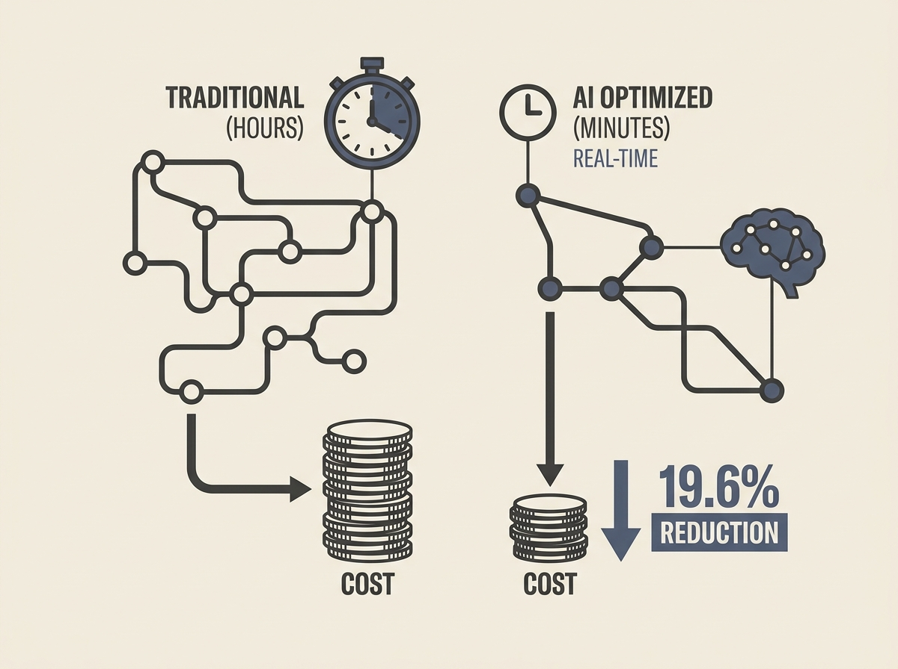

Solving complex logistics problems like the Vehicle Routing Problem (VRP) dynamically, especially with stochastic demands and outsourcing options, is notoriously difficult. This paper introduces a two-level deep reinforcement learning approach that significantly moves the needle.

The core innovation is an offline-trained policy using a deep Q-network with a Graph Attention Network (GAT) to estimate VRP routing costs almost instantly. This allows for real-time decision-making, crucial for dynamic scenarios.

The results are compelling: a 19.6% routing cost reduction over state-of-the-art methods and decisions made in minutes, not hours. This showcases how advanced AI techniques can deliver substantial, tangible benefits in operational efficiency.