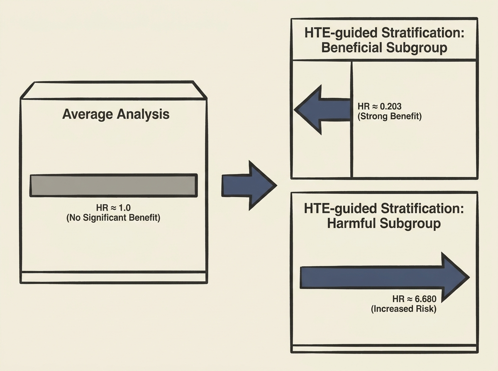

Traditional clinical trials often overlook the crucial reality that treatment effects are not uniform across all patients. This research highlights how leveraging real-world Electronic Health Record (EHR) data can revolutionize clinical trial design by uncovering heterogeneous treatment effects (HTEs).

By emulating the DAPA-HF trial, the study found that while the overall cohort showed no significant benefit from dapagliflozin, HTE-driven stratification identified subgroups with dramatically different responses. A "beneficial" subgroup showed a strong survival benefit (HR = 0.203), while a "harmful" subgroup experienced significantly increased mortality risk (HR = 6.680).

This work powerfully demonstrates that focusing on HTEs can reveal clinically meaningful insights masked by average effects, paving the way for more precise and personalized medicine. It is a compelling case for applied AI in healthcare.