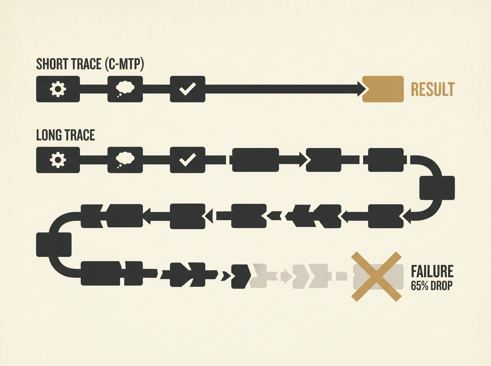

Continuous Chain-of-Thought (CoT) models are a promising direction for efficient LLM reasoning, but this paper reveals a crucial limitation. While introducing a simpler and faster direct supervision method (C-MTP) that performs competitively on short traces, the real takeaway is a significant performance drop - roughly 65 percent - when current continuous CoT models face complex tasks with longer reasoning traces.

This means that if your agent or application requires multi-step reasoning that cannot be compressed into very short latent representations, existing continuous CoT techniques are likely to fall short. The challenge lies in how these models represent and propagate reasoning over extended sequences.

For senior engineers building agents or LLM-powered systems, this is a vital piece of information. It means we cannot simply assume continuous CoT will scale effectively to arbitrarily complex problems yet, and it signals a clear area for further research and engineering focus to bridge this reasoning gap.