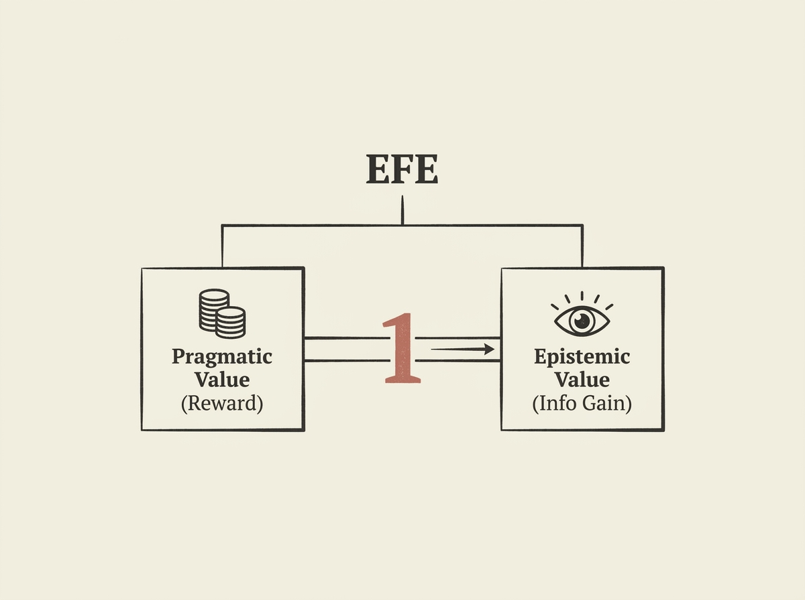

Designing AI agents that effectively balance exploration and exploitation under uncertainty is a fundamental challenge, often requiring extensive manual tuning of exploration weights. This paper presents a significant theoretical and practical breakthrough by showing that minimizing Expected Free Energy (EFE) provides an elegant, untuned solution.

It establishes an equivalence between EFE and rho-POMDPs where the utility is precisely expected information gain, crucially fixing the exploration weight at one. This means that pragmatic and epistemic value are expressed in the same units, eliminating the need for heuristic tuning altogether.

Experiments demonstrate that this out-of-the-box approach often matches or even surpasses carefully tuned, reward-only planning methods across various complex environments. For engineers building autonomous agents, this offers a more robust and theoretically grounded mechanism for intrinsic motivation and information gathering, simplifying development and potentially leading to more adaptable and intelligent agents.