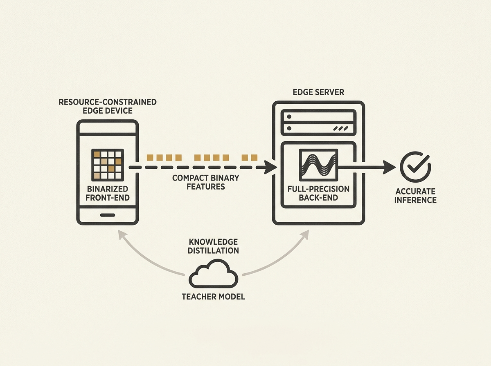

Edge inference is crucial for low-latency AI, but balancing communication efficiency, on-device compute costs, and inference accuracy remains a significant challenge. This new framework, using hybrid-precision models, offers an elegant solution.

The core idea involves deploying a binarized front-end on resource-constrained edge devices to extract and transmit compact binary features. A full-precision back-end on the edge server then performs the final, high-accuracy inference.

This integrated approach includes a specialized binarization method for split inference and a channel-aware transmission scheme. Knowledge distillation is used to optimize the entire end-to-end system, inheriting semantic knowledge from larger teacher models.

For engineers building responsive AI services at the network edge, this design demonstrates an optimal trade-off, enabling powerful AI on constrained hardware.