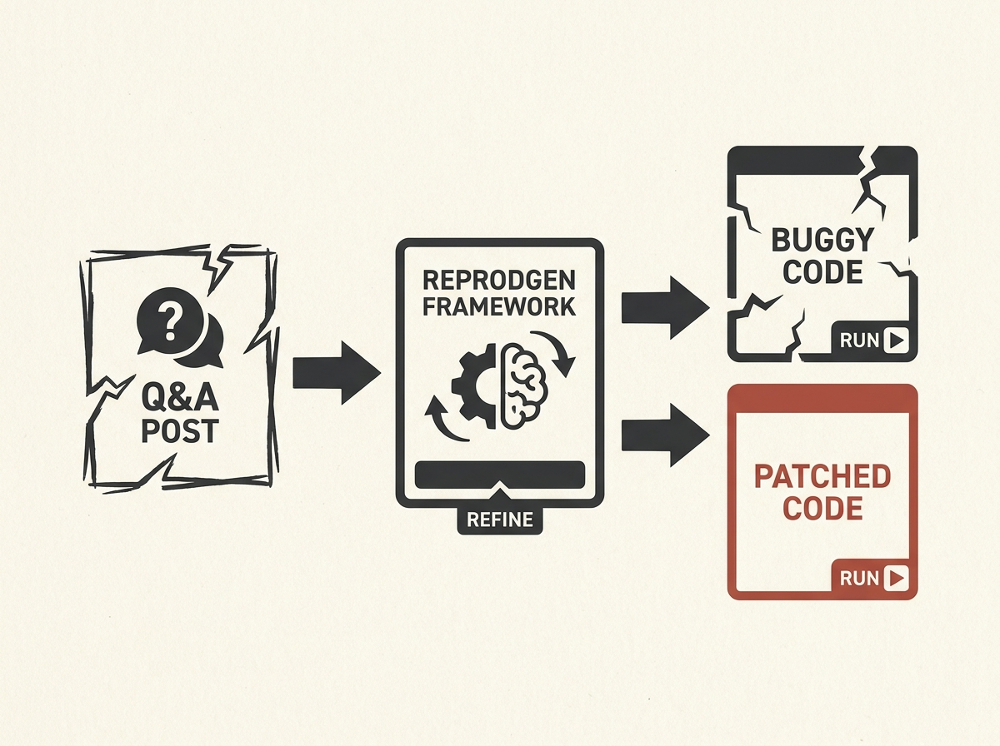

Imagine an LLM that can turn a Stack Overflow discussion about a data science bug into a runnable, reproducible example, complete with a patch. That is Reprodgen.

This framework automatically reconstructs executable buggy and patched data science programs from Q&A forum posts. It achieves this by building structured representations of code intent and functional requirements, then iteratively refining the code using an LLM-based reviewer.

This tackles a significant pain point for data scientists and engineers: the ambiguity and incompleteness of informal code discussions. It offers a tangible step towards automated debugging and verification from real-world problem descriptions, leading to faster issue resolution and improved code quality.