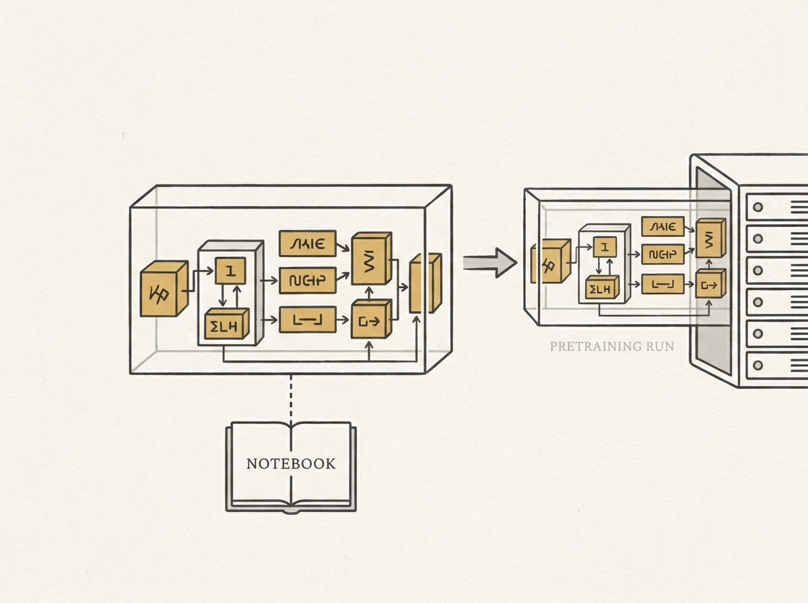

OpenLanguageModel (OLM) is an open-source PyTorch library designed to make building and pretraining small language models more transparent and accessible. Its core philosophy centers on keeping the model's machinery visible.

The library ensures model code reads like the architecture itself, with components as ordinary modules and clear descriptions of how they are wired. This composable approach allows a model to move seamlessly from a teaching notebook to a full pretraining run or research ablation, without modification.

OLM handles tokenizers, datasets, optimization, mixed precision, and hardware-aware execution across CPU, single-GPU, and multi-GPU setups. This commitment to readability and practical engineering makes it an excellent resource for anyone wanting to truly understand and build LLM infrastructure.