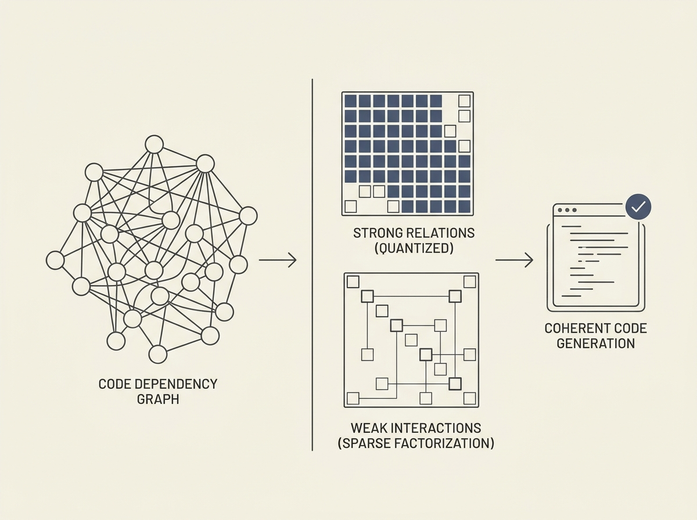

Automated code generation often struggles with producing code that is both semantically correct and structurally consistent, particularly in complex systems. This paper introduces a dependency-guided framework to tackle that problem head-on.

The framework models intricate, multi-level dependencies among code entities using a graph-based representation. It then decomposes these dependencies into a quantized matrix for strong relations and a sparse low-rank factorization for weaker interactions.

By incorporating this learned dependency structure as a constraint during generation, the system ensures both semantic coherence and structural fidelity. This approach is a significant step forward for those building or relying on advanced code generation tools, offering a path to higher quality, more maintainable generated code.