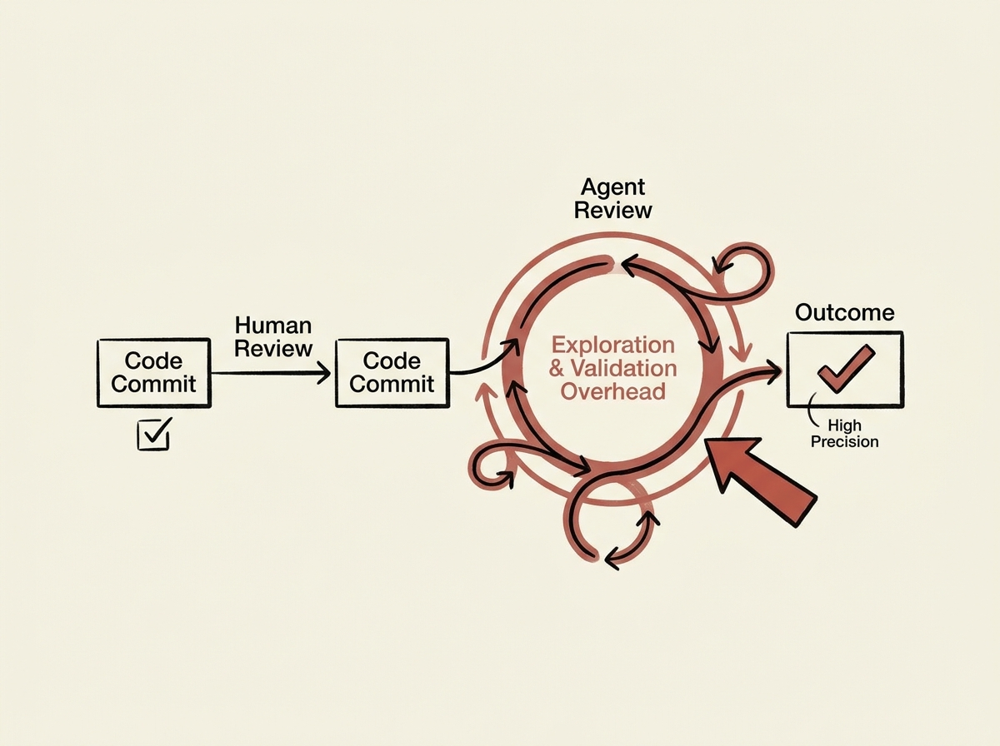

Agentic code review, especially in terminal environments, offers exciting potential for early feedback in local development. However, simply deploying an agent is not enough; understanding its behavior, cost, and alignment with human workflows is critical.

This study provides a trajectory-level analysis, revealing that while agentic reviewers achieve higher precision, they incur substantial exploration and validation overhead. A key finding is that successful reviews are strongly associated with more robust planning and less need for downstream validation.

These insights are crucial for any senior engineer designing or integrating AI agents into development workflows. It underscores that optimizing agent performance requires more than just high accuracy; it demands a deep understanding of their operational dynamics and how to minimize hidden costs to truly enhance developer productivity.