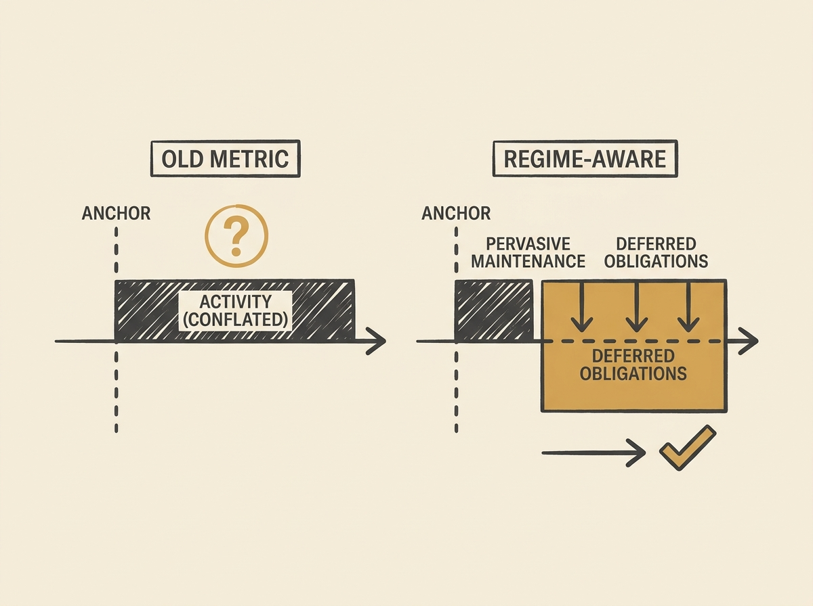

Are you measuring technical debt and project stabilization effectively? A new study suggests that traditional "post-anchor stabilization density" metrics (counting tests, CI, docs after architectural changes) are failing, especially in AI-evidence projects.

Researchers found that this metric conflates pervasive maintenance with genuine technical debt. In a study of 338 high-visibility GitHub repositories, they observed no post-anchor uplift in stabilization signals.

The paper introduces "stabilization regimes" to provide a more accurate, regime-aware attribution for identifying true stabilization obligations. This offers a much-needed, nuanced approach for engineering leaders to assess project health and technical debt.