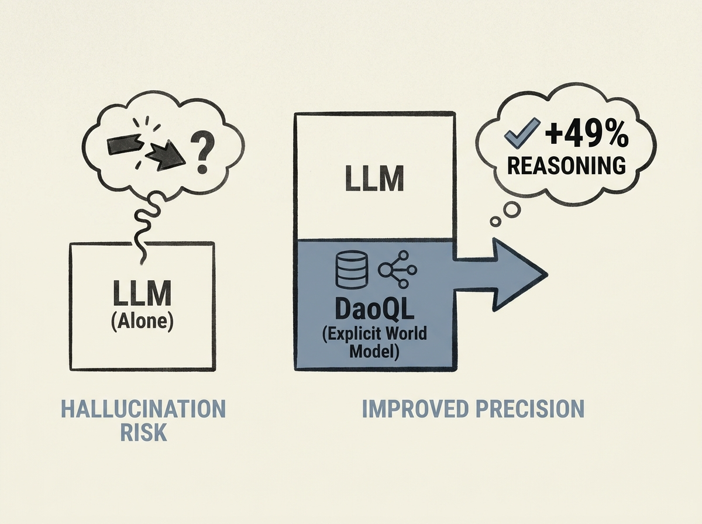

Large Language Models struggle with hallucination and outdated knowledge, especially in high-stakes fields like medicine or finance. This paper introduces `DaoQL`, a multimodal database designed to give LLMs an *explicit* world model, separating reasoning from deterministic knowledge.

By treating LLMs as pure reasoning engines and moving verifiable facts into `DaoQL`'s integrated graph, column, vector, and full-text storage, the system mitigates fundamental LLM risks. In counterfactual experiments, `DaoQL` + GPT-4o achieved 94% composable counterfactual decomposability, a 49 percentage point improvement over GPT-4o alone.

This data-first ontology provides a robust architectural guarantee that implicit models lack. It is a critical step towards building reliable AI agents for precision domains, offering a practical blueprint for tackling trust and explainability issues head-on.
