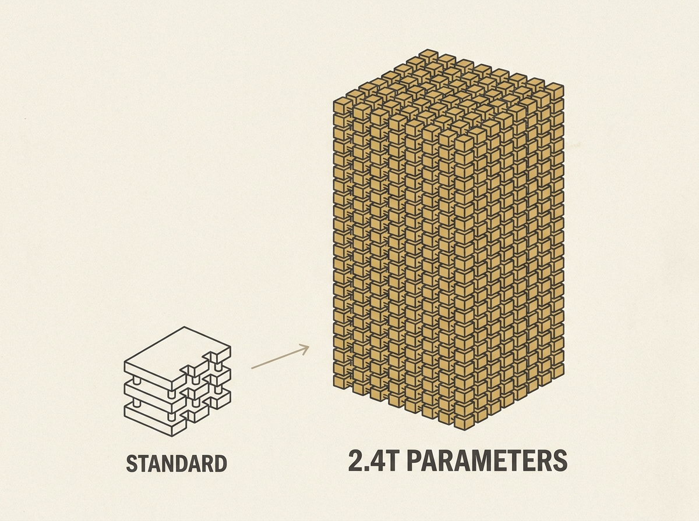

Alibaba's Qwen team is launching Qwen 3.8, a staggering 2.4 trillion parameter large language model, slated for an open-weight release soon. This is a significant development, as such large models typically remain proprietary.

Positioned as a frontier AI model, Qwen 3.8 aims to compete directly with leading proprietary solutions. The sheer scale suggests potential for advancements in applied AI and for developers looking to build on top of powerful, accessible models.

Engineers evaluating LLM infrastructure choices and exploring future AI agent capabilities should pay close attention. An open-weight model of this magnitude offers substantial opportunities for research and practical application.
